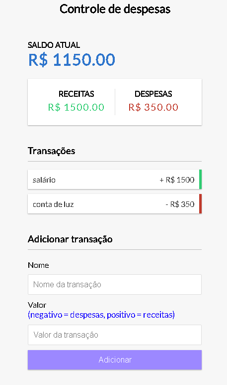

# controle-financeiro

<h3>Memoria salva em cache local pode atualiza a página </h3>

<h3>Usar o - na frente do número para adicionar despesas </h3>

<h3> para excluir alguma caixa de transação clique no começo fora da caixa que vc quer excluir </h3>

